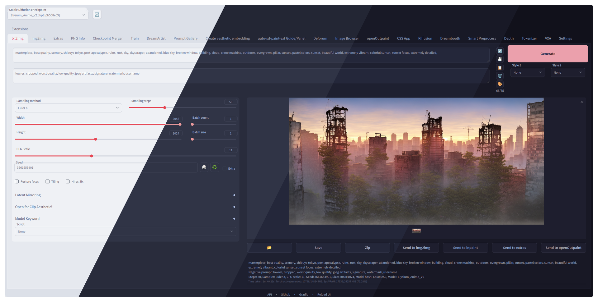

<h3 align="center">
 
Catppuccin Theme for <a href="https://github.com/AUTOMATIC1111/stable-diffusion-webui">Stable Diffusion Web UI</a>
</h3>

 

 

### Installation 

1. Open WebUI
2. Click on the "**Extensions**" tab
3. Click on the "**Install from URL**" section
4. Paste `https://github.com/Haoming02/catppuccin-theme` into the `URL for extension's git repository` field
5. Click on "`Install`"
6. Click on the "**Installed**" section, and click on "`Apply and restart UI`"
7. **(Optional)** Configure the theme in the "`Catppuccin Theme`" section under the <ins>User Interface</ins> category in the **Settings** tab

### 💝 Special Thanks to

- [Kettukaa](https://github.com/Kettukaa)
- [Ryan Cao](https://github.com/ryanccn)
- [Catppuccin](https://github.com/catppuccin)

 

 
Copyright &copy; 2021-present <a href="https://github.com/catppuccin">Catppuccin Org</a> 

